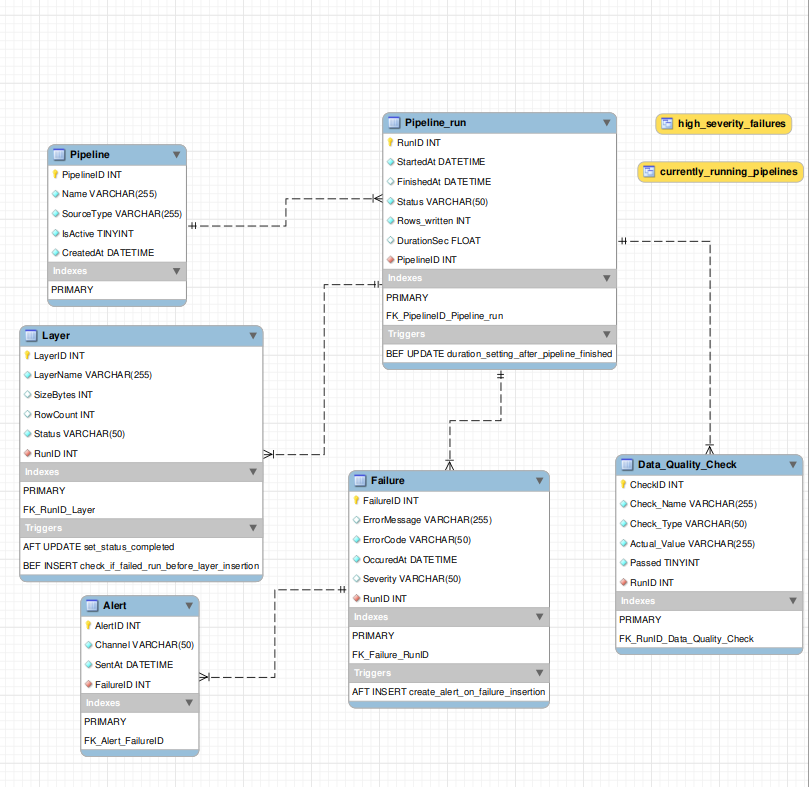

Data Pipeline Observability System
A MySQL database project that tracks and monitors data pipelines - logging runs, layers, data quality checks, failures, and automated alerts. Built to demonstrate real-world database engineering: schema design, normalization, triggers, stored procedures, views, and testing.

What the Project Is
Modern data teams run dozens of pipelines daily. When something breaks — a timeout, a bad schema, a null explosion — you need to know immediately: which pipeline failed, at which layer, how severe it was, and whether anyone was notified.
This database system answers those questions by storing the full lifecycle of every pipeline run, from start to finish, including automated business logic enforced directly at the database level.

Project Structure
Data_Pipeline_Observation/
├── Data_Pipeline_Observation_ddl.sql            ← Database and table definitions
├── Data_Pipeline_Observation_data_insertion.sql ← Sample data
├── Triggers.sql                                 ← Automated business rules
├── Stored_Procedures.sql                        ← Reusable database logic
├── Views.sql                                    ← Prebuilt queries for monitoring
├── Testing.sql                                  ← Tests for all triggers, procedures and views
├── README.md                                    ← This file
└── erd.png                                      ← Entity-Relationship Diagram

ERD Diagram

Schema Overview

Table
Description
Pipeline
Registered pipelines with source type and active status
Pipeline_run
Each execution of a pipeline — start, finish, status, rows written
Layer
Bronze / Silver / Gold layer tracking per run
Data_Quality_Check
Validation checks run against data — null checks, volume checks, schema checks
Failure
Errors that occurred during a run — message, code, severity
Alert
Notifications sent when failures occur — channel and timestamp

Triggers
1. duration_setting_after_pipeline_finished
BEFORE UPDATE on Pipeline_run
Automatically calculates DurationSec when FinishedAt is set. No manual math required — the database computes it using TIMESTAMPDIFF(SECOND, StartedAt, FinishedAt).
2. set_status_completed
AFTER UPDATE on Layer
When a layer is marked as completed, checks whether all layers for that run are now completed. If yes, automatically updates the parent Pipeline_run status to completed. Keeps run status always in sync with its layers.
3. check_if_failed_run_before_layer_insertion
BEFORE INSERT on Layer
Prevents inserting a new layer into a run that has already failed. Raises a SIGNAL SQLSTATE '45000' error with a descriptive message. Enforces data integrity at the database level rather than relying on application code.
4. create_alert_on_failure_insertion
AFTER INSERT on Failure
When a high severity failure (Severity = 'high') is inserted, automatically creates an Alert record on the email channel. Critical failures always generate an alert without any manual intervention.

Stored Procedures
1. start_new_pipeline_run(IN p_PipelineID, OUT p_RunID)
Starts a new pipeline run for a given pipeline. Inserts a row into Pipeline_run with Status = 'running' and returns the new RunID as an OUT parameter.
CALL start_new_pipeline_run(1, @new_run_id);
SELECT @new_run_id;
2. update_finish_time(IN p_RunID, IN p_FinishedAt)
Marks a pipeline run as finished by setting FinishedAt. The duration_setting_after_pipeline_finished trigger automatically calculates DurationSec on the same update.
CALL update_finish_time(1, '2026-01-01 09:30:00');
3. health_report(IN p_PipelineID)
Returns a summary report for a specific pipeline: total rows written, average run duration, and total number of failed runs.
CALL health_report(1);

Views
1. currently_running_pipelines
Shows all pipelines currently in a running state, including the pipeline name, when it started, and how many seconds it has been running (live calculation using TIMESTAMPDIFF(SECOND, StartedAt, NOW())).
SELECT * FROM currently_running_pipelines;
2. high_severity_failures
Shows all high severity failures joined with their pipeline name and a flag IsAlertSent (1 if an alert was sent, 0 if not). Useful for auditing whether critical failures were properly handled.
SELECT * FROM high_severity_failures;

How to Run Locally
Prerequisites
    • MySQL Server 8.0+ 
    • MySQL Workbench (optional but recommended) 
Steps
    1. Clone the repository: 
git clone https://github.com/yourusername/data-pipeline-observability.git
cd data-pipeline-observability
    2. Open MySQL Workbench and connect to your local server, or use the CLI: 
mysql -u root -p
    3. Run the scripts in this exact order: 
SOURCE Data_Pipeline_Observation_ddl.sql;
SOURCE Triggers.sql;
SOURCE Stored_Procedures.sql;
SOURCE Views.sql;
SOURCE Data_Pipeline_Observation_data_insertion.sql;
    4. Optionally run the test suite to verify everything works: 
SOURCE Testing.sql;
    5. Verify the views are working: 
USE Data_Pipeline_Observation;
SELECT * FROM currently_running_pipelines;
SELECT * FROM high_severity_failures;
CALL health_report(1);

Key Concepts Demonstrated
    • Normalized relational schema design from an ERD 
    • Foreign key constraints with meaningful naming conventions 
    • TINYINT for booleans, DATETIME with DEFAULT NOW(), nullable columns for incomplete data 
    • BEFORE and AFTER triggers with NEW keyword 
    • SIGNAL SQLSTATE for custom error handling inside triggers 
    • IN and OUT parameters in stored procedures 
    • LAST_INSERT_ID() for returning auto-generated keys 
    • CREATE OR REPLACE VIEW with multi-table joins and live calculations 
    • COALESCE for NULL-safe aggregations 
    • CASE WHEN inside views for derived boolean flags 

